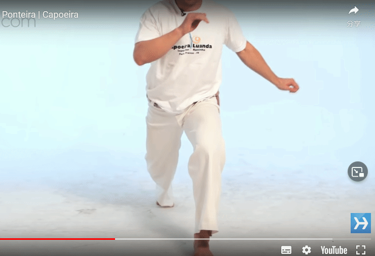
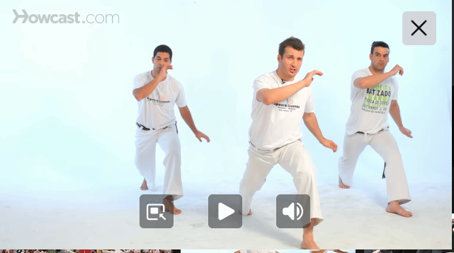
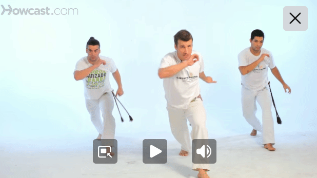
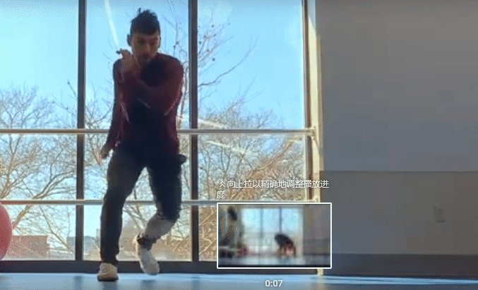
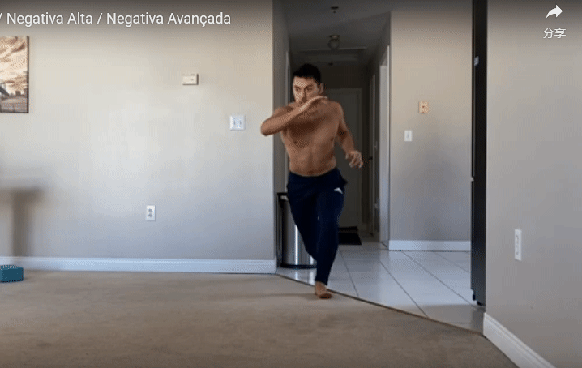

- [Fundamental Movements](#fundamental-movements)
  - [Attacks (Kicks)](#attacks-kicks)
    - [Meia Lua de Frente (半月踢)](#meia-lua-de-frente-半月踢)
    - [Queixada](#queixada)
    - [Armada (旋转踢)](#armada-旋转踢)
    - [Compasso (指南针踢)](#compasso-指南针踢)
    - [Bencao （前直踢）](#bencao-前直踢)
    - [Martelo](#martelo)
    - [Ponteira](#ponteira)
  - [Defense](#defense)
    - [Esquiva](#esquiva)
    - [Cocorinha](#cocorinha)
    - [Negativa](#negativa)
    - [Role](#role)
    - [Esquiva Baixa](#esquiva-baixa)
    - [Esquiva de Lado](#esquiva-de-lado)
    - [Negativa de Angola](#negativa-de-angola)
    - [Negativa da Regional / Negativa de Bimba](#negativa-da-regional--negativa-de-bimba)
    - [Queda de Quatro](#queda-de-quatro)
    - [Passo a Frente](#passo-a-frente)
    - [Vale Meu Deus](#vale-meu-deus)

# Fundamental Movements

（以下内容来源于https://www.lalaue.com，作者在原创基础上进行信息整合及翻译，仅自我学习及交流使用，无任何商业行为）

## Attacks (Kicks)

### Meia Lua de Frente (半月踢)

**逐步解析 （右腿踢）**
- 正向起势，将身体重心转移到左腿上
- 将右腿从外向内，呈半圆型踢出，目标是partner的下巴或侧脸，某些时候也可以是目标的腹部
- 右踢结束后，身体应该回到正向深蹲（deep squatted）体式，重新找到身体平衡
- **在踢的过程中，摆动双手使其与腿的方向相反，以保持身体平衡**

### Queixada

**逐步解析 （右腿踢）**
- ginga起势，左腿在后右腿在前
- 右脚向左前方上一小步，同时将重心放在右腿上，身体面向左边
- 将左腿向前，交叉踏在右脚后方，同时将身体重心向前转移，创造向前的冲力
- 当身体的重心全部转移到左脚上时，释放右腿，依靠**肩膀带动胯部**向右扭转的力量，将右腿笔直的横扫至右边，目标是partner的下巴
- 右踢结束后，身体应该回到ginga体式，这时右腿在后左腿在前
  

### Armada (旋转踢)

**逐步解析 （右腿踢）**
- ginga起势，首先将一只脚向前一步，并使身体继续扭转，直到上身及视线再次回到正前方时，释放后腿并进行圆踢
- armada和queixada从执行来讲基本是同样的动作，区别在于armada是从一只脚向前旋转身体开始的
- 在旋转及踢腿的过程中，身体重心会被转移到向前迈出的腿上
- **踢腿的力量来自于身体旋转带动胯部扭转的力**

### Compasso (指南针踢)

**逐步解析**
- 正向起势，一只腿向前迈一步，将胸转向后腿，并将两手置于双腿之中
- 将身体重心转移到目标侧的腿上，从双腿之间**注视目标**
- 后腿伸直，举起后腿并靠**臀部旋转的冲力**向前圆踢，用脚跟攻击目标头部或肋部
- **在整个动作的过程中，核心收紧，并时刻注视对手**

### Bencao （前直踢）

**逐步解析**
- ginga起势，重心放置在后脚的同时前脚向前推踢，身体微后倾以保持平衡
- 目标通常为对手的胸部或腹部，用脚掌或脚跟击打

### Martelo

**逐步解析**
- ginga起势，抬起后腿膝盖（类似bencao），脚跟向外转动90-180°
- 抬起同时记得臀部同时发力抬起（与踢出的腿保持同一水平），身体微后倾以保持平衡
- 股对准目标，快速踢出，脚背用以攻击
- **在踢的过程中，摆动双手使其与腿的方向相反，以保持身体平衡**

### Ponteira

攻击性较强的动作，通常在竞技性强的game中出现，**谨慎使用**

**逐步解析**
- ginga起势，将后腿猛烈的甩向前方，想象将穿着的凉鞋甩出的感觉
- Ponteira的踢呈圆弧轨迹，目标是对方的腹部/胸部，踢的过程中腿是由弯到直的，而不是始终保持笔直
- 用脚跟攻击，发力是靠小腿甩出的惯性，而不是纯肌肉发力
- Ponteira可以在Martelo之后使用，踢完后脚不落地，紧接着下一个动作

## Defense

区别于其他格斗类运动，Capoeira在面对攻击时，往往更倾向于采取躲避攻击的方式，而不是阻断攻击的方式去防御，以保证game的流动性。除此之外，capoeira的攻击在身体接触时往往会造成大的伤害，用接触去阻断攻击或许不是最理想的方式。

### Esquiva

- 将头和身体顺着攻击的方向倾斜

### Cocorinha

- 顺着攻击的方向用肘保护头部，并深蹲
- cocorinha之后可以流畅的接高踢或接下一个低位动作
- cocorinha可以在距离对手较近的位置进行，对后续进攻做出很好的连接

### Negativa

Negativa是最基础的地面动作之一，一般用来躲避对胸/头部的攻击，也对后续动作进行连接（接别的Esquivas, Role，Au等地面动作）。
- 臀部以一只脚的脚跟为支点蹲下
- 另一只腿伸出，同侧的手支撑地面，另一只手护住面部，身体重心向前，为动作带来更多机动性
- 支撑地面的手放置在身体前侧而不是后侧

### Role

- 类似于Au，双手支地，双腿从一侧贴地扫到另一侧
- Role可以帮助躲避一个攻击，并为下一个动作做足准备，常在Esquiva之后做出，在Roda中移动到下一个点位
- Role与Ginga，Au同属于Roda中的基础移动性动作，在双手支地的过程中，视线从双腿之中时刻注视对手
- 在Role过程中将头着地，变化成Role de Cabeca， 从而过渡成其他的头部支撑动作

### Esquiva Baixa

又名Esquiva de Frente，看起来像是一个贴近地面的Ginga
- 身体前倾，后腿向后延展，使身体重心放在前面弯曲的腿上

### Esquiva de Lado

- 将身体转向侧面以躲避攻击，双腿平行，呈深蹲姿态，前臂护住面部
- 通常也是queixada的准备动作

### Negativa de Angola

越贴近地面越好，用来躲避低的攻击
- 将双手支撑地面，与腿垂直
- 压低身体，使肢体几乎与地面水平

### Negativa da Regional / Negativa de Bimba

Mestre Bimba常用的动作，这个动作的第一个目的是为了躲避从正面来的攻击（如Bencao），第二个目的是为了用另一只脚扫向对手，使其倒地

### Queda de Quatro

- 螃蟹步，这个动作用在地面动作衔接，或倒地时
- 双膝向内收，脚距与肩同宽

### Passo a Frente

用来应对突入而来的迎面攻击
- 向前一小步，微曲双膝，收紧核心，身体向后倒向一侧
- 衔接Role重新回到Ginga或连接其他动作

### Vale Meu Deus

这个动作可用来躲避紧急的攻击，并与对手保持近的距离
- 如攻击从左边到来，朝攻击到来的方向伸出右腿，脚落在对手附近
- 同时核心收紧，胯部顶出，上身弯曲以躲避攻击
- 右手臂向身体右后侧支撑（轻轻支地），胯部保持发力顶出，另一只手保护面部

 
